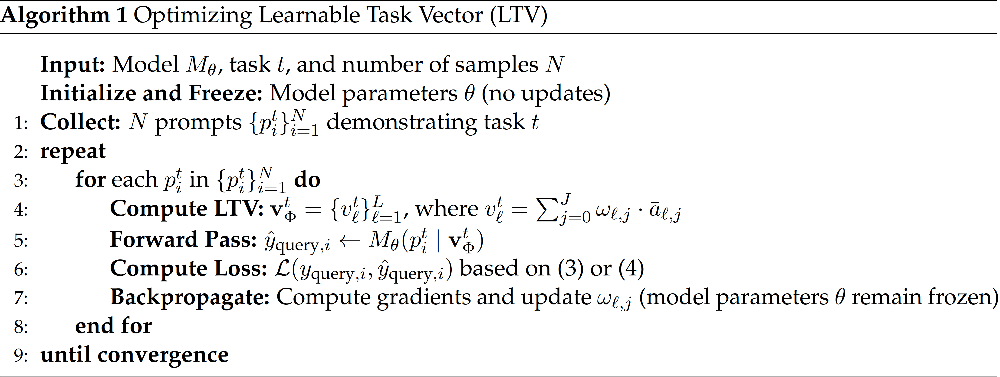

# Learning Task Representations from In-Context Learning


## Getting Started

### 0.1 Dependencies
Install the required dependencies using ``pip``. We provide separate ``requirements.txt`` files for functional regression and language tasks, located in their respective directories.

```
pip install -r regression/requirements.txt
pip install -r language/requirements.txt
```

### 0.2 Install the forked ``transformers`` package 

We modified a few lines in [``modeling_gpt2.py``](https://github.com/huggingface/transformers/blob/main/src/transformers/models/gpt2/modeling_gpt2.py) to track and manipulate attention outputs for computing/adding the LTV. These changes don't affect the package’s functionality.
```
cd transformers
pip install .
```

**Note:** 
- For functional regression tasks, we use the [code](https://github.com/dtsip/in-context-learning) from [Garg et al.](https://arxiv.org/abs/2208.01066)
- For linguistic tasks, we use the [code](https://github.com/ericwtodd/function_vectors) from [Todd et al.](https://functions.baulab.info/)

## Training a Learnable Task Vector


### 1. Synthetic Tasks
#### 1.0 Download Pretrained Custom GPT-2 Models
We use models trained by [Garg et al.](https://arxiv.org/abs/2208.01066), which differ slightly from standard GPT-2 pretraining. These models include an additional linear layer for preprocessing numerical inputs and use smaller hidden layers. Refer to the paper for more details.

```
cd synthetic
wget https://github.com/dtsip/in-context-learning/releases/download/initial/models.zip
unzip models.zip
```

#### 1.1 Train a Learnable Task Vector [optional]
Train a task vector for a specified function class. This process first generates a dataset of size $100 \times \texttt{batch size}$, then trains the LTV layer on it. Example usage:
```
cd src
python regression/train.py --task linear_regression --seq_len 71 --batch_size 512 --lr 5e-5
```

#### 1.2 Inference with the Trained Learnable Task Vector
The ``regression/demo.ipynb`` notebook provides a tutorial on functional regression inference for:
1. Custom vanilla GPT-2 (9.5M)
2. GPT-2 + Function Vectors (_baseline method_)
3. GPT-2 + Learnable Task Vector (_ours_)
4. GPT-2 + In-Context Vector (_baseline method_).

### 2. Language Tasks
#### 2.1 Train a Learnable Task Vector [optional]
```
python language/train.py --dataset commonsense_qa --n_examples 10 --batch_size 256
```

#### 2.2 Inference with the Trained Learnable Task Vector
The ``language/demo.ipynb`` notebook provides a tutorial for language inference on:
1. Standard GPT-J (6B)
2. GPT-J + Function Vectors (_baseline method_)
3. GPT-J + Learnable Task Vector (_ours_)